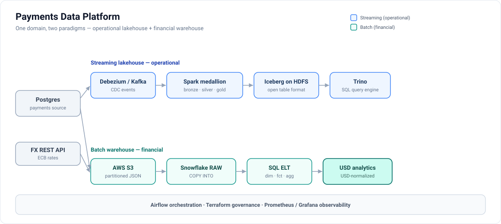
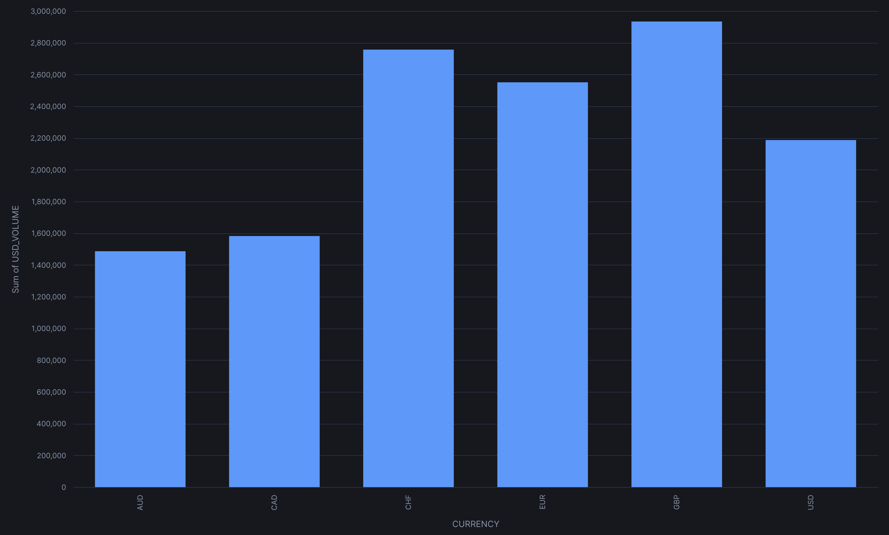
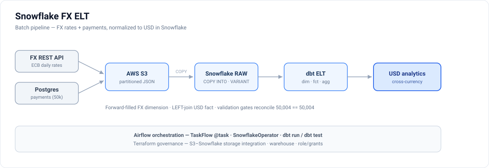

# Payments Data Platform

**Live site:** [cheng-alex-chang.github.io/payments-data-platform](https://cheng-alex-chang.github.io/payments-data-platform/) — visual tour + hosted dbt lineage browser.

A payments data-engineering project that runs **both** dominant analytics paradigms over one domain:

- **Streaming lakehouse (operational):** `Postgres → Debezium/Kafka Connect → Kafka → PySpark → Iceberg on S3 → Trino` — near-real-time CDC on an open table format.
- **Batch cloud warehouse (financial):** `FX REST API + Postgres → AWS S3 → Snowflake + dbt` — incremental batch ELT that normalizes every payment to USD for cross-currency analytics over a star schema.

Shared across both: `Airflow` orchestration, `Terraform` governance (Databricks + Snowflake/S3), an `Iceberg REST catalog` over `MinIO`/S3 object storage, `Trino` interactive SQL over Iceberg, a `FastAPI` serving tier over gold, `Prometheus + Grafana` observability, and `pytest` + GitHub Actions CI.

See [docs/design.md](docs/design.md) for layer contracts (both pipelines), incremental processing, and CDC delete handling; [snowflake_etl/README.md](snowflake_etl/README.md) for the Snowflake FX ELT; and [docs/production-readiness.md](docs/production-readiness.md) for the hardening backlog.

## Deployment targets

The same medallion contract (bronze → silver → gold, CDC-aware) runs three ways:

| Target | What it is | Entry point |
|--------|------------|-------------|
| **Kubernetes (kind)** | The production-shaped deployment — the whole platform as Kustomize manifests (MinIO, Iceberg REST catalog, Trino, Kafka/Debezium, Spark, Airflow, observability) | `bash scripts/k8s_up.sh` |
| **Docker Compose** | The fast inner loop — same services, same config files, one command, no cluster | `docker compose up -d` |
| **Databricks (Lakeflow)** | Serverless Unity Catalog + Delta port as a Lakeflow Declarative Pipeline — Auto Loader, AUTO CDC, expectations — deployed via an Asset Bundle | [`databricks/`](databricks/README.md) |

Kubernetes is the realistic target: nothing ships to production on Compose. Compose stays because
it starts in seconds and is the faster edit-run loop — the same split most teams actually run.
**Both read the identical config files**: the Kustomize ConfigMaps are generated straight from
`config/`, `airflow/dags/`, `scripts/`, and `sql/`, so the two runtimes cannot drift. The only
exceptions are two files under [`k8s/base/overrides/`](k8s/base/overrides) that must genuinely
differ on Kubernetes (Trino's heap and query-memory ceilings, sized for a single packed node), each
documenting why in its header.

## Architecture



**Streaming lakehouse** — near-real-time CDC into an open table format:

```text
Postgres
  -> Debezium / Kafka Connect            CDC via logical replication
  -> Kafka topic: cdc.public.payments
  -> Spark bronze job                    Structured Streaming -> Iceberg append
  -> Spark silver job                    foreachBatch -> Iceberg MERGE / DELETE
  -> Spark gold job                      Batch SQL -> Iceberg INSERT OVERWRITE
  -> Trino                               SQL over Iceberg via the REST catalog
```

**Batch cloud warehouse** — a second source (FX rates) staged to S3, USD-normalized in Snowflake:

```text
FX REST API + Postgres
  -> stage_to_s3                         newline-JSON to S3, partitioned by dt
  -> Snowflake COPY INTO                 RAW VARIANT landing tables
  -> dbt ELT                             stg -> dim_date / dim_fx_rates -> fct_payments_usd (incremental)
  -> agg_payments_by_currency            monthly USD-normalized volume + FX drift
```

## Bronze, Silver, Gold

`Bronze`
- Raw Kafka envelope written to Iceberg, append-only
- Streaming with `trigger(availableNow=True)` and an object-storage checkpoint
- PII fields (`shopper_id`) hashed with SHA-256 before the write so PII never lands in the lakehouse

`Silver`
- Canonical payment records, typed and normalised
- Dedup by `payment_id` (highest Postgres `source_lsn`, tiebroken by `kafka_offset`) before MERGE so reruns and full Kafka replays converge to the same current state
- `foreachBatch` issues one sequenced `MERGE INTO` covering all four ops — delete, update and insert branches — guarded on `s.source_lsn > t.source_lsn` so an out-of-order batch cannot overwrite newer state, and a delete-then-recreate resolves by sequence rather than by which pass ran last

`Gold`
- Hourly aggregates per country and payment method (count, gross volume, auth rate)
- Reads only silver — strictly linear `bronze → silver → gold` lineage, no bronze or Debezium-envelope access
- Full idempotent recompute: one `GROUP BY` over silver, `INSERT OVERWRITE` replaces the whole table every run (so hours emptied by deletes drop out)

## Gold Serving API

The pipeline moves data inward — Postgres → CDC → Kafka → Spark → Iceberg → Trino. That gets an
analyst to a SQL prompt and Grafana to a chart, but nothing hands results back to an application.
A read-only **FastAPI** tier closes that loop over the same gold table. See [`api/`](api/README.md).

```bash
# On Kubernetes, first: kubectl port-forward -n data-pipeline svc/api 8000:8000
curl 'http://localhost:8000/v1/metrics/hourly?country_code=NL&limit=5'
curl 'http://localhost:8000/v1/metrics/summary?start=2026-03-01T00:00:00'
```

The API also serves its own consumer at `/` — an internal ops console built entirely from those
endpoints, with no CORS policy, no second deployment, and no CDN. It is what the serving tier
exists for: Grafana queries Trino directly and Prometheus only scrapes `/metrics`, so without it
nothing actually *reads* the gold API.


Two details in that screenshot are load-bearing rather than decorative. The **snapshot id** in the
header is the Iceberg version the response cache is keyed on — a new gold commit changes it and
invalidates the cache exactly. **Load more** returns the keyset cursor untouched, which is why the
page has no page numbers at all.

Four decisions carry the design:

- **Filters compile to SQL, not Python.** Gold is `PARTITIONED BY (days(payment_hour))`, so a bounded
  range lets Iceberg prune files before anything is read. Filtering in the process would make every
  request a full-table scan.
- **Keyset pagination, not `OFFSET`.** `OFFSET` makes the engine read and discard every skipped row;
  the cursor encodes the last `(payment_hour, country_code, payment_method)` seen, so page 500 costs
  what page 1 costs.
- **Cache keyed on the Iceberg snapshot id, not a TTL.** Every `INSERT OVERWRITE` on gold commits a
  new snapshot, so keying entries on it makes invalidation exact — a response can't outlive the data
  it was built from, and never expires early while the data is unchanged.
- **Money is a string on the wire.** `gross_volume` is `DECIMAL(18,2)`; as a JSON number it would
  reach a browser as an IEEE double and reintroduce the rounding the warehouse type prevents.

The whole suite runs with **no Trino driver installed and no warehouse reachable** — the driver is
imported lazily inside `connect_from_env`, so tests inject a fake DBAPI connection underneath the
real repository. That's why `trino` lives in `requirements-api.txt`, not `requirements-ci.txt`:
keeping it out of CI is what proves the lazy import still holds.

## Repo Layout

```text
airflow/dags/                  Airflow DAGs
api/src/                       FastAPI serving tier over the gold Iceberg table
config/airflow/                Airflow Docker image
config/api/                    Serving API Docker image
config/connect/                Debezium connector config
config/grafana/                Grafana provisioning and dashboards
config/postgres/init/          Postgres schema and seed data
config/prometheus/             Prometheus config
config/spark/Dockerfile        Spark image with the medallion's Maven dependencies pre-resolved
config/spark/jobs/             Spark jobs + the shared payment rules they and the DLT port both enforce
config/statsd/                 StatsD exporter mapping for Airflow metrics
config/trino/                  Trino config and Iceberg catalog
config/trino-exporter/         Custom Trino REST -> Prometheus exporter
databricks/                    Databricks Lakeflow (DLT) port + Asset Bundle
docs/                          Design docs
infra/terraform/databricks/    Terraform for Databricks Unity Catalog governance (schema, volume, grants)
infra/terraform/snowflake/     Terraform for Snowflake + S3 governance (warehouse, role/grants, storage integration, stage)
k8s/                           Kubernetes manifests, local overlay, and kind cluster config
scripts/                       Helper scripts
snowflake_etl/                 Snowflake FX ELT: REST-API + Postgres -> S3 -> Snowflake (extractors, loader, SQL models, DAG)
sql/trino/                     Trino validation SQL
tests/                         Unit tests
```

## Run Locally

Two paths. **Kubernetes** is the production-shaped one and the default recommendation; **Compose**
is the faster edit-run loop. Both read the identical config files, so they cannot drift.

### Prerequisites

- `Docker Desktop` — the container runtime under both paths (`kind` runs its nodes as containers).
  Allocate at least **12 GB** of memory; the full platform is 22 containers.
- `kind` and `kubectl` — Kubernetes path only
- `Python 3`

### Kubernetes (production-shaped)

`scripts/k8s_up.sh` creates a local `kind` cluster and applies the Kustomize overlay, rendering the
full platform: stateful databases, MinIO, the Iceberg REST catalog, Trino, Kafka/Connect, Spark job templates,
Airflow, the gold serving API, and observability (including provisioned Grafana datasources and
dashboards). `python3 scripts/validate_k8s_manifests.py` renders the overlay and prints the object
count. Connector registration, the demo re-seed, and the Spark Jobs ship suspended, so they cannot
fire before their dependencies are Ready.

The ConfigMaps are generated from the repo's real config files rather than a copy kept in step by
hand, so a Spark job or seed script edit reaches both runtimes at once. Those paths sit outside the
kustomization root, so the render uses `--load-restrictor=LoadRestrictionsNone`; the tradeoff is
that the kustomization is no longer relocatable, which costs nothing for a repo-local overlay.

```bash
bash scripts/k8s_up.sh
export KUBECONFIG=.kind/kubeconfig
kubectl get statefulsets,pods,svc,pvc -n data-pipeline
python3 scripts/validate_k8s_manifests.py
```

The cluster reserves no fixed host ports, so reach a UI with a port-forward — for example Airflow
(it serves 8080 in the pod; 8088 keeps the Compose URL working):

```bash
kubectl port-forward -n data-pipeline svc/airflow-webserver 8088:8080
```

[docs/kubernetes.md](docs/kubernetes.md#reaching-a-ui) lists the command for every UI.

Tear the cluster down with `bash scripts/k8s_down.sh`.

See [docs/kubernetes.md](docs/kubernetes.md) for the full startup order, verification commands, and
remaining runtime caveats.

**Verified end-to-end on a live cluster:** Debezium connector registration, Airflow running all nine
pipeline tasks natively (three of them as `KubernetesPodOperator` Spark pods), Trino reconciling
bronze = silver = gold at 50,004 payments across 8,764 hourly buckets, and the gold API answering
against that same data.

### Docker Compose (fast inner loop)

```bash
cp .env.example .env                 # placeholder passwords; the file stays untracked
docker compose up -d
bash scripts/register_connector.sh   # Kubernetes does this with a Job instead
```

`scripts/k8s_up.sh` seeds its own `secrets.env` automatically, so the copy above is the one manual
step Compose has and Kubernetes does not.

All long-running services use `restart: unless-stopped` and expose healthchecks (Kafka, MinIO, Trino, Airflow, Postgres variants). Dependent services wait on `condition: service_healthy` before starting, so the stack self-recovers from individual container crashes without manual intervention.

Compose publishes fixed host ports, so the UIs are reachable directly:

- Airflow: `http://localhost:8088`
- Kafka Connect: `http://localhost:8083`
- Trino: `http://localhost:8080`
- MinIO console: `http://localhost:9001`
- Iceberg REST catalog: `http://localhost:8181/health`
- Payments Gold API: `http://localhost:8000/` (console) · `/docs` (OpenAPI UI)
- Prometheus: `http://localhost:9090`
- Grafana: `http://localhost:3001`

### Reload the demo data

Both runtimes seed automatically on first start, when Postgres finds an empty data directory. To
replay the seed into an environment that already exists:

```bash
# Kubernetes — a suspended Job that mounts the same postgres-init ConfigMap the database does
kubectl patch job seed-demo-data -n data-pipeline -p '{"spec":{"suspend":false}}'
kubectl wait --for=condition=complete job/seed-demo-data -n data-pipeline --timeout=120s

# Compose
python3 scripts/load_demo_data.py
```

Then trigger the Airflow DAG again so bronze, silver, and gold pick up the new CDC events. The seed
is idempotent either way — `CREATE TABLE IF NOT EXISTS` plus `ON CONFLICT DO NOTHING`.

## Run tests

The default suite is runtime-independent — no running services, no credentials, about a
second.

```bash
source .venv/bin/activate
pytest --cov --cov-report=term-missing
```

The end-to-end CDC test is excluded from that run and selected explicitly. It starts nine
containers and drives a real payment from Postgres through Debezium, Kafka and Spark into
Iceberg:

```bash
pytest -m integration_cdc tests/integration/test_cdc_chain.py
```

CI runs the fast suite as six per-component jobs behind a single project-wide coverage
gate, then builds four images to GHCR, proves the CDC chain end to end, and deploys those
exact digests into an ephemeral kind cluster for smoke and data-quality checks before
anything can merge. The mechanics of the three expensive stages live in a separate
[platform-ci](https://github.com/cheng-alex-chang/platform-ci) repository and are consumed
at a pinned version, so the pipeline shape stays this repo's business while the stage
implementations are shared. Full detail in [docs/ci-cd.md](docs/ci-cd.md).

## Databricks (Lakeflow Declarative Pipeline)

The medallion is also ported to **Databricks** as a serverless **Lakeflow Declarative Pipeline** on Unity Catalog + Delta: Auto Loader ingestion, `apply_changes` (AUTO CDC) for the silver upsert/delete, and expectations for data quality — deployed as a Databricks Asset Bundle and orchestrated by a Workflow (seed → pipeline → validate).

Governance (the `analytics` schema and the `landing` volume) is provisioned declaratively with **Terraform** — a clean infra-vs-workload split: Terraform owns the Unity Catalog objects, the Asset Bundle owns the pipeline and Workflow. Terraform must `apply` first, because the seed job no longer self-creates the schema/volume:

```bash
terraform -chdir=infra/terraform/databricks init
terraform -chdir=infra/terraform/databricks apply   # creates workspace.analytics + landing volume

cd databricks
databricks bundle deploy -t dev
databricks bundle run payments_pipeline -t dev
```

Verified on Databricks Free Edition: the Delta tables reconcile 124 → 124 → 124 and all silver expectations report 124 passed / 0 failed. **Free Edition caveat:** `workspace` is a built-in catalog (not created by Terraform) and grants are restricted, so the Terraform scope is the schema + volume; the full grants showcase (`-var 'enable_grants=true'`) needs a standard workspace. See [databricks/README.md](databricks/README.md) for setup, the architecture diagram, and design notes.

## Snowflake FX ELT (batch + cloud warehouse)

A second ingestion pipeline runs the other dominant paradigm — **batch into a cloud warehouse** — over the same payments domain. A pull-based **FX-rates REST API** (Frankfurter / ECB) and the Postgres payments table (extracted **incrementally** by `updated_at` watermark) are staged to **AWS S3** as date-partitioned JSON, loaded into **Snowflake** `RAW` VARIANT tables with `COPY INTO`, then transformed by a **dbt** ELT — a Kimball-style star schema whose FX dimension forward-fills weekend/holiday gaps and whose incremental fact normalizes every payment to USD:

```text
FX REST API + Postgres → S3 (raw/<dataset>/dt=…) → Snowflake RAW (VARIANT)
  → stg_* → dim_fx_rates (forward-fill) → fct_payments_usd (amount × rate) → agg_payments_by_currency
```


It's orchestrated by an Airflow DAG (`airflow/dags/snowflake_fx_etl.py`) using TaskFlow `@task` for the S3 staging, `SnowflakeOperator` (managed `snowflake_default` connection) for the RAW load, and `dbt run` / `dbt test` for the transform + data-quality gates, with webhook failure alerting on both DAGs. **Terraform** (`infra/terraform/snowflake/`, remote S3 state) governs the database, RAW/ANALYTICS schemas, an XS auto-suspend warehouse, a least-privilege role, and the AWS↔Snowflake wiring (S3 bucket + storage integration + external stage); Snowflake auth is **key-pair** (password only as fallback). This is a deliberate **two-tier** design, not a duplicate of the lakehouse: the lakehouse serves *hourly operational* analytics; Snowflake serves *monthly, USD-normalized* financials.

Everything is verifiable offline (mocked S3, fake Snowflake cursor, `terraform validate`); the live load against a Snowflake 30-day trial + S3 Free Tier is a one-session activity that's then torn down. **Verified live:** `stage → COPY INTO → ELT` reconciles **50,004 == 50,004** payments with all four data-quality gates passing, yielding **$13.5M** in USD-normalized volume across 6 currencies. See **[snowflake_etl/README.md](snowflake_etl/README.md)** for the architecture, run commands, test tiers, and trial caveat, and [docs/production-readiness.md](docs/production-readiness.md) for the hardening backlog.

## Airflow Pipeline

The main DAG is `airflow/dags/payments_pipeline.py`, and it orchestrates **both** runtimes:

1. `init_object_store` — creates the warehouse and checkpoint buckets over the **S3 API**
2. `init_catalog` — bootstraps the Iceberg REST catalog and registers the warehouse
3. `validate_connector` — Debezium connector and task are `RUNNING`
4. `validate_schema` — source schema matches what the pipeline expects
5. `bronze_load` · `silver_transform` · `gold_transform` — the Spark medallion
6. `publish_trino_tables` — the Iceberg tables are visible to Trino (and **fails** if one is missing)
7. `validate_trino` — bronze = silver = gold reconciliation
8. `maintain_iceberg` — compaction, snapshot expiry, orphan cleanup

Every task except the three Spark ones is **runtime-neutral**: it speaks HTTP to a service name
(`trino:8080`, `minio:9000`, `iceberg-rest:8181`) that resolves as a Compose service name and a Kubernetes Service
DNS name alike. No task shells into a container by name.

Spark submission is the one thing that genuinely differs, because Compose has no cluster to
schedule against. `airflow/dags/spark_jobs.py` returns a `KubernetesPodOperator` when
`PIPELINE_RUNTIME=kubernetes` and a `BashOperator` otherwise; the job specs live in one place and
tests assert the Compose command and the Kubernetes Job templates still agree with them.

Manual trigger:

```bash
# Kubernetes
kubectl exec -n data-pipeline deploy/airflow-scheduler -- \
  airflow dags trigger payments_pipeline -r manual-1

# Compose
docker exec dp-airflow-webserver airflow dags trigger payments_pipeline
```

## Demo Flow

Written for **Kubernetes**. Every step works on Compose too — only the way you reach into a
container changes. The same command, both runtimes:

```bash
# Kubernetes
kubectl exec -n data-pipeline postgres-0 -- psql -U dataeng -d payments -c "SELECT COUNT(*) FROM payments;"

# Compose
docker exec dp-postgres psql -U dataeng -d payments -c "SELECT COUNT(*) FROM payments;"
```

Only the prefix changes. To translate any step below, swap the workload for its container name:

- `postgres-0` → `dp-postgres` and `kafka-0` → `dp-kafka` — StatefulSets are addressed as pods, Compose containers by name
- `deploy/trino` → `dp-trino` and `deploy/airflow-scheduler` → `dp-airflow-webserver` — `deploy/<name>` lets Kubernetes pick a pod for you

Add `-it` to `kubectl exec` when running the Trino CLI, or it drops to a dumb terminal and prints a
JLine warning.

Note that this is a *human* reaching into a container to inspect state. The pipeline itself never
does: every Airflow task addresses services over HTTP by name, which is why the same DAG runs
unchanged in both runtimes.

### 1. Show the source data in Postgres

```bash
kubectl exec -n data-pipeline postgres-0 -- \
  psql -U dataeng -d payments -c "SELECT payment_id, amount, payment_status, updated_at FROM payments ORDER BY payment_id;"
```

### 2. Change a source row

```bash
kubectl exec -n data-pipeline postgres-0 -- \
  psql -U dataeng -d payments -c "UPDATE payments SET amount = 149.99, payment_status = 'authorized', updated_at = NOW() WHERE payment_id = 1001;"
```

### 3. Show the CDC event in Kafka

```bash
kubectl exec -n data-pipeline kafka-0 -- kafka-console-consumer \
  --bootstrap-server kafka:29092 \
  --topic cdc.public.payments \
  --from-beginning \
  --max-messages 1 \
  --timeout-ms 5000
```

### 4. Trigger the Airflow DAG

```bash
kubectl exec -n data-pipeline deploy/airflow-scheduler -- \
  airflow dags trigger payments_pipeline -r demo-1
```

### 5. Confirm the DAG run

```bash
kubectl exec -n data-pipeline deploy/airflow-scheduler -- \
  airflow dags list-runs -d payments_pipeline
```

### 6. Query the silver table in Trino

```bash
kubectl exec -it -n data-pipeline deploy/trino -- \
  trino --execute "SELECT payment_id, amount, payment_method, payment_status, created_at, updated_at FROM iceberg.analytics.payments_silver"
```

### 7. Query the gold table in Trino

```bash
kubectl exec -it -n data-pipeline deploy/trino -- \
  trino --execute "SELECT * FROM iceberg.analytics.payment_metrics_gold ORDER BY payment_hour, country_code, payment_method"
```

## Observability

Grafana is for **operating the platform**, not for business reporting. Business analytics is served
by the [gold API](api/README.md) — that is where a consumer should go for payment volume by country.
Prometheus is a metrics store, not an analytics store: pushing business dimensions
(country × method × merchant) into it causes cardinality explosion, and the data already lives in
Iceberg with full history.

Two provisioned dashboards, both in the `Data Platform` folder at `http://localhost:3001`:

**Platform Overview** — infrastructure and service health from Prometheus: Airflow scheduler
heartbeat, task completions by state, Trino query activity, and the gold API's request rate, p99
latency by endpoint, and snapshot-cache hit ratio.

**Pipeline Output Validation** — *is the pipeline producing sane output?* These panels read the
curated **gold** layer (`iceberg.analytics.payment_metrics_gold`) through **Trino**, so they catch
bad loads: row counts that stop reconciling, an authorization rate outside its plausible band, an
hour with no volume (a missed load), a sudden shift in method or country mix. The two refund panels
still read source Postgres — `refunds` is tracked for schema-drift only and has no silver/gold layer
yet (a separate refunds medallion is future work). Panels:

- total payments _(gold)_
- gross volume _(gold)_
- authorization rate _(gold, payment-weighted across hourly groups)_
- refund events _(source Postgres)_
- hourly volume trend _(gold)_
- payment method mix _(gold)_
- gross volume by country _(gold)_
- refunds over time _(source Postgres)_

Two states are expected and **not** bugs:
- **On first container start** Grafana downloads the `trino-datasource` plugin (`GF_INSTALL_PLUGINS`), which needs internet access.
- **Until the `payments_pipeline` DAG has run**, gold is empty, so the six gold panels render blank. That is by design — the dashboard now mirrors pipeline output, so no run means no data. Trigger the DAG and the panels populate.

## Project Tour

This project is easiest to understand when viewed from three angles:

- orchestration in Airflow
- CDC and analytics results in Kafka and Trino
- business-facing metrics in Grafana

Airflow shows the pipeline running from source validation through bronze, silver, gold, and downstream validation.


Grafana shows the seeded demo data as business-facing metrics, including volume, authorization rate, refunds, and payment method mix.


Trino shows the materialized gold layer directly, making it easy to inspect the hourly aggregates produced by the pipeline.


### Snowflake FX ELT

The batch pipeline normalizes every payment to USD in Snowflake. Native volume is nearly equal across the six currencies, but USD-normalized volume diverges purely from FX rates — the reason the pipeline exists.



The pipeline itself: two sources staged to S3, loaded into Snowflake RAW, and transformed to USD by dbt.


