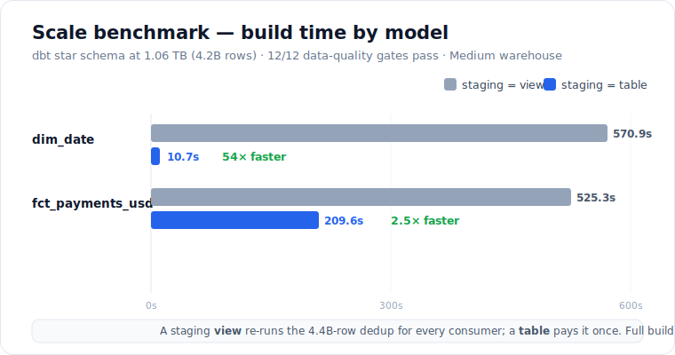

# Scale Benchmark — the dbt star schema at ~1 TB

The Snowflake warehouse pipeline is normally exercised at 50K payments. This benchmark runs
the **same dbt project, unchanged**, against **~1 TB** of synthetic data to measure how the
star schema behaves at scale and to find where it breaks.

**Headline:** the dbt star schema built and passed all 12 data-quality gates over
**4.2 billion payments (1.06 TB of logical JSON)**; a 5M-row daily increment reconciles
exactly; and materializing the staging dedup as a table (vs a view) cuts the conformed
`dim_date` build from **9.5 min to 11s**.



## Method — generate in the warehouse, not on a laptop

A real terabyte can't be produced on a laptop and shipped over a home uplink to S3.
Instead, [`snowflake_etl/benchmark/scale_benchmark.py`](../snowflake_etl/benchmark/scale_benchmark.py)
fabricates the rows **server-side** with Snowflake's `GENERATOR` table function — no network
transfer — writing the **exact RAW VARIANT contract** the staging models already parse
(`amount` as a JSON string, ISO timestamps, the 6-currency mix). So the identical dbt project
builds the identical star schema, just at 4.2B rows instead of 50K.

Everything lands in a **separate** `PAYMENTS_SCALE` database and `BENCH_WH` warehouse
(dropped at teardown); dbt is retargeted by env vars only (`SNOWFLAKE_DATABASE` /
`SNOWFLAKE_WAREHOUSE`) — no model changes. ~5% of payment ids are re-emitted as a newer
version so RAW carries duplicate versions per key, exactly like the real accumulating daily
snapshots, giving the QUALIFY dedup genuine work to do.

```bash
python -m snowflake_etl.benchmark.scale_benchmark setup --warehouse-size MEDIUM
python -m snowflake_etl.benchmark.scale_benchmark generate --rows 4200000000
python -m snowflake_etl.benchmark.scale_benchmark measure
dbt run --full-refresh && dbt test           # against PAYMENTS_SCALE / BENCH_WH
python -m snowflake_etl.benchmark.scale_benchmark delta --rows 5000000 --id-offset 4200000000
dbt run                                        # incremental — processes only the delta
python -m snowflake_etl.benchmark.scale_benchmark teardown
```

## Results (Medium warehouse)

### Volume
| Metric | Value |
|---|---|
| Raw payment rows | **4,410,000,000** (4.2B base + 210M duplicate versions) |
| Logical JSON size | **1.06 TB** (`SUM(LENGTH(TO_JSON(raw)))`) |
| Compressed on disk | **~70 GB** (~15× Snowflake columnar compression) |
| Distinct payments in fact | **4,200,000,000** (dedup collapses the 210M duplicates) |
| FX rows | 1,572 (business days × 6 currencies over 12 months) |
| Generation time | 20.6 min (~52s per 250M-row chunk, 17 chunks) |

### Full build + data-quality gates (staging = view, the default)
`dbt run --full-refresh` — **18.8 min**; `dbt test` — **12/12 PASS** in 5.4 min.

| Model | Rows | Build time |
|---|---|---|
| `stg_payments` / `stg_fx_rates` | (views) | <1s |
| `dim_date` | 366 | **570.9s** |
| `dim_fx_rates` | 2,196 | 1.8s |
| `fct_payments_usd` | 4,200,000,000 | **525.3s** |
| `agg_payments_by_currency` | 390 | 23.6s |

Key gates: `fact_reconciles_to_payments` (285s) proves 4.41B raw deduped to exactly 4.2B
distinct in the fact; `unique_fct_payments_usd_payment_id` (168s) confirms no duplicate key
survived; `usd_payments_unchanged` (9s) confirms USD stays the identity.

### Incremental daily increment
A 5M-row "next day" batch → incremental `dbt run` processed **exactly 5,000,000 rows**
(not 4.2B); the fact went 4,200,000,000 → 4,205,000,000 and reconciled. The incremental
`MERGE` net-changed 5M rows — but its underlying scan still read **182 GB / 2.2B rows**,
because staging is a view (see below).

## Finding — the staging view is the scale bottleneck

Staging models are **views**, so every downstream consumer re-evaluates them — each
re-running the QUALIFY dedup over all 4.41B raw rows. It shows up in three places: `dim_date`
(570s, almost entirely a min/max scan of the deduped view), the full `fct` build, and even
the *incremental* run (852s wall, 182 GB scanned, to net-change 5M rows).

Flipping staging to a **table** (`DBT_STAGING_MATERIALIZED=table` — a configurable knob in
`dbt_project.yml`) pays the dedup **once** and lets every consumer read the result:

| Model | staging = view | staging = table | Speedup |
|---|---|---|---|
| `stg_payments` | — (view) | 486.8s (dedup materialized once) | — |
| **`dim_date`** | **570.9s** | **10.7s** | **~54×** |
| `fct_payments_usd` | 525.3s | 209.6s | ~2.5× |
| Full build total | 1126s | 736s | ~1.5× |

The full-build total only improves ~1.5× (both designs still write 4.2B fact rows), but the
per-consumer dedup cost collapses — and the win compounds with every added consumer and with
incremental runs, where a staging table turns the 182 GB rescan into a cheap filtered read.
The right default is therefore a **table** once staging outgrows small-scale; the view stays
the default here because it is free and always-fresh at 50K.

## Limitations (stated plainly)

- **Synthetic data.** Distributions are deterministic/uniform, not real payment traffic;
  the point is throughput and the dedup/join/aggregate behavior, not business realism.
- **Single run, single warehouse size** (Medium). No warehouse-size sweep, no concurrency.
- **Trial account.** Run once for evidence, then torn down; the code persists. This is why
  the Snowflake integration test is gated and the driver lives in `requirements-snowflake.txt`,
  not CI.
- **Storage metrics lag.** Compressed bytes come from `TABLE_STORAGE_METRICS`, which updates
  asynchronously; the logical `TO_JSON` size is the authoritative volume number.

## Cost

The entire benchmark — generate 4.2B, full build, 12 tests, incremental delta, and the
view-vs-table comparison — ran in well under two hours of Medium-warehouse time
(≈ 6–8 credits), inside the free 30-day trial allotment.
