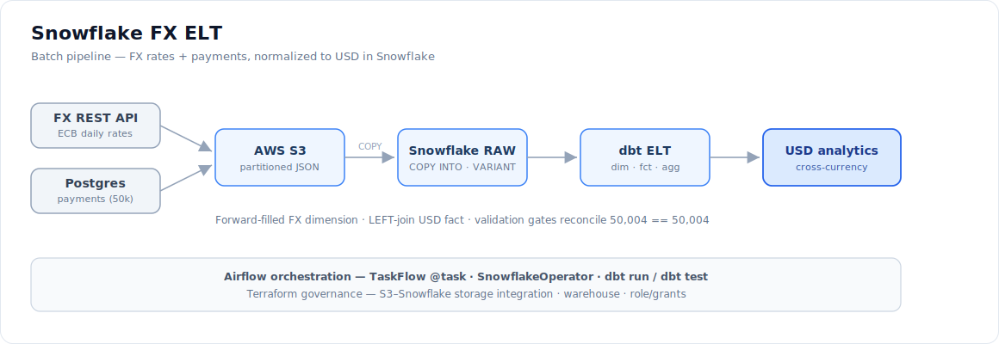
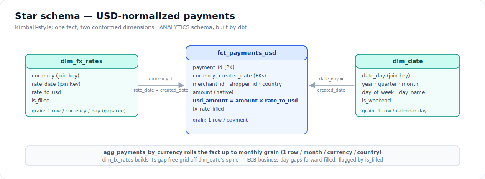

# Snowflake FX ELT — batch + cloud warehouse

A second ingestion pipeline alongside the streaming lakehouse: a **pull-based FX-rates REST
API** plus the Postgres payments table, staged through **AWS S3** and loaded into a **Snowflake
ELT** that normalizes every payment to USD for cross-currency analytics.

## Why it exists (the storytelling spine)

The streaming half of this project (`Postgres → Debezium/Kafka → Spark → Iceberg/Trino`) is
*operational analytics* — near-real-time, open lakehouse, for engineering. This half is the
other dominant paradigm: *batch + cloud warehouse* — for finance/BI.

**Business hook:** payments arrive in 6 currencies (EUR/USD/GBP/CAD/AUD/CHF) and you can't sum
mixed currencies. This pipeline joins daily ECB FX rates to 12 months of payments and computes
`usd_amount = amount × rate_to_usd`, so revenue is summable in one reporting currency. The two
pipelines are **two consumption tiers, not duplicates**: the lakehouse produces *hourly
operational* gold; this produces *monthly, USD-normalized* financials.

## Architecture



```text
Frankfurter FX API ─▶ extract_fx_rates ─┐
(ECB daily rates)                       │  @task (parallel; payments incremental by updated_at)
                                        ├─▶ stage_to_s3 ─▶ s3://bucket/raw/<dataset>/dt=<date>/*.jsonl
Postgres payments  ─▶ extract_payments ─┘                          │
(50k / 12mo / 6ccy)                                                ▼  COPY INTO (SnowflakeOperator)
                                                          RAW.RAW_FX_RATES / RAW.RAW_PAYMENTS  (VARIANT)
                                                                   │  dbt run (star schema)
                                                                   ▼
   stg_* (type+dedup) ─▶ dim_date ─▶ dim_fx_rates (forward-fill) ─▶ fct_payments_usd (incremental) ─▶ agg
                                                                   │
                                                          dbt test (12 data-quality gates)
```

Orchestrated by Airflow (`airflow/dags/snowflake_fx_etl.py`), governed by Terraform
(`infra/terraform/snowflake/`).

## Components

| Layer | Code | What it does |
|---|---|---|
| Extract | [src/extract_fx_rates.py](src/extract_fx_rates.py), [src/extract_payments.py](src/extract_payments.py) | FX from a keyless REST API (inverts ECB quote → `rate_to_usd`); payments via a server-side Postgres cursor, **incrementally** windowed by `updated_at` (Airflow data interval) |
| Stage | [src/stage_to_s3.py](src/stage_to_s3.py) | Newline-JSON to date-partitioned S3 keys; `Decimal` money kept as a string for exact precision |
| Load | [src/load_to_snowflake.py](src/load_to_snowflake.py) | `COPY INTO` VARIANT landing tables; idempotent via COPY load history |
| Transform | [dbt/](dbt/) (**dbt** project `payments_fx`) | Typed staging, forward-filled FX dimension, USD fact, monthly aggregate; validation gates as dbt tests |

## Data model

The warehouse side is a Kimball-style **star schema**, built by dbt with the grain of every
model stated in [dbt/models/schema.yml](dbt/models/schema.yml):



| Model | Kind | Grain |
|---|---|---|
| `fct_payments_usd` | fact | one row per payment (USD-normalized) |
| `dim_fx_rates` | dimension | one row per currency per calendar day, gap-free |
| `dim_date` | conformed dimension | one row per calendar day (owns the spine) |
| `agg_payments_by_currency` | aggregate | one row per month × currency × country |

`dim_date` owns the calendar spine; `dim_fx_rates` builds its gap-free grid off it, and the
fact's `created_date` joins to both. Grain is enforced, not just documented — `unique` +
`not_null` dbt tests pin one-row-per-key on the fact and both dimensions.

### The two hard bits

- **Forward-fill** ([dbt/models/marts/dim_fx_rates.sql](dbt/models/marts/dim_fx_rates.sql)) — ECB publishes business days only,
  so a weekend/holiday payment has no rate. A calendar spine × currencies is filled with
  `LAST_VALUE(... ) IGNORE NULLS` (carry last known rate forward; a backward `FIRST_VALUE` covers
  the leading edge). `is_filled` flags carried days.
- **AWS↔Snowflake trust** ([infra/terraform/snowflake/main.tf](../infra/terraform/snowflake/main.tf)) —
  the IAM role trusts the storage integration's external id, which only exists *after* the
  integration is created (which needs the role ARN). Broken by computing the role ARN as a string
  so the integration doesn't depend on the role resource — one clean `apply`.

## Run it

Everything below runs **offline** (no cloud accounts):

```bash
# Extractors hit the live free FX API / local Postgres; print samples, write nothing
python -m snowflake_etl.src.extract_fx_rates --dry-run
python -m snowflake_etl.src.stage_to_s3 --datasets fx_rates --dry-run

# Loader prints the exact SQL it would run, without connecting
python -m snowflake_etl.src.load_to_snowflake --dry-run

# dbt compiles the whole model DAG without connecting (profiles.yml has parse-safe defaults)
dbt parse --project-dir snowflake_etl/dbt --profiles-dir snowflake_etl/dbt

# Tests: mocked tier always runs; terraform validates against real provider schemas
pytest tests/test_extract_fx_rates.py tests/test_stage_to_s3.py tests/test_load_to_snowflake.py \
       tests/test_dbt_project.py tests/test_snowflake_dag.py
terraform -chdir=infra/terraform/snowflake init -backend=false && \
terraform -chdir=infra/terraform/snowflake validate
```

### Two test tiers

- **Mocked (always-on)** — `moto` S3, fake Snowflake cursor, faked Airflow. Runs in CI, offline,
  and on any clone. No cloud accounts, no driver.
- **Gated integration** ([tests/integration/](../tests/integration/)) — real S3 round-trip + live
  Snowflake connect/COPY. **Skips** unless `AWS_*` / `SNOWFLAKE_*` are set:
  ```bash
  pip install -r requirements-snowflake.txt
  AWS_ACCESS_KEY_ID=… S3_BUCKET=… SNOWFLAKE_ACCOUNT=… SNOWFLAKE_USER=… \
  SNOWFLAKE_PRIVATE_KEY_PATH=~/.snowflake/rsa_key.p8 \
  SNOWFLAKE_STAGE=PAYMENTS_LAKE_STAGE pytest -m integration
  ```

## Cloud run + teardown

The live end-to-end (real Snowflake 30-day trial + AWS S3 Free Tier) is a one-session activity:

```bash
# Auth is key-pair: generate a key, register the public half on your user once
# (ALTER USER ... SET RSA_PUBLIC_KEY), then export the PATH (never the key itself).
export SNOWFLAKE_PRIVATE_KEY_PATH=~/.snowflake/rsa_key.p8  DBT_TARGET=trial_keypair
# Terraform's 1.x snowflake provider wants the account SPLIT (the connector takes it combined)
# and JWT for key-pair:
export SNOWFLAKE_ORGANIZATION_NAME=ORG  SNOWFLAKE_ACCOUNT_NAME=ACCT   # halves of ORG-ACCT
export SNOWFLAKE_AUTHENTICATOR=SNOWFLAKE_JWT  SNOWFLAKE_PRIVATE_KEY="$(cat ~/.snowflake/rsa_key.p8)"
export SNOWFLAKE_USER=…  AWS_ACCESS_KEY_ID=…  AWS_SECRET_ACCESS_KEY=…
export TF_VAR_s3_bucket=your-unique-bucket  TF_VAR_aws_region=us-east-1
terraform -chdir=infra/terraform/snowflake apply  # db, schemas, warehouse, role, bucket, integration, stage
# (state is remote: versioned S3 bucket + native lockfile, see versions.tf)

# Then run the pipeline (or trigger the DAG). The connector uses the combined SNOWFLAKE_ACCOUNT:
export SNOWFLAKE_ACCOUNT=ORG-ACCT  S3_BUCKET=$TF_VAR_s3_bucket  SNOWFLAKE_ROLE=ACCOUNTADMIN
python -m snowflake_etl.src.stage_to_s3 --bucket $S3_BUCKET --run-date $(date +%F)
python -m snowflake_etl.src.load_to_snowflake --run-date $(date +%F)
dbt run  --project-dir snowflake_etl/dbt --profiles-dir snowflake_etl/dbt
dbt test --project-dir snowflake_etl/dbt --profiles-dir snowflake_etl/dbt

terraform -chdir=infra/terraform/snowflake destroy   # tear down — net ~$0
```

**Verified live** (Snowflake trial + S3 Free Tier, key-pair auth with no password in the
environment): `stage → COPY INTO → dbt` loaded **50,004** payments + 1,536 FX rows; `dbt run`
builds all 6 models (incremental fact: full refresh 50,004, no-change re-run processes 0) and
`dbt test` passes **12/12** (the four original gates — reconcile 50,004 == 50,004, no unmatched
USD, no null/zero rate, USD identity — plus grain-enforcing unique/not_null tests); total
normalized volume **$13,498,004.56** across 6 currencies, with the monthly aggregate showing
real ECB FX drift.

**Trial caveat:** the Snowflake trial expires after 30 days, so the live load is run once for
evidence then torn down; the code persists. That's why the Snowflake integration test is gated
(never a permanent CI dependency) and the driver lives in `requirements-snowflake.txt`, not CI.

See [docs/production-readiness.md](../docs/production-readiness.md) for the hardening backlog
(key-pair auth, IAM roles, DAG alerting, remote Terraform state, …).
